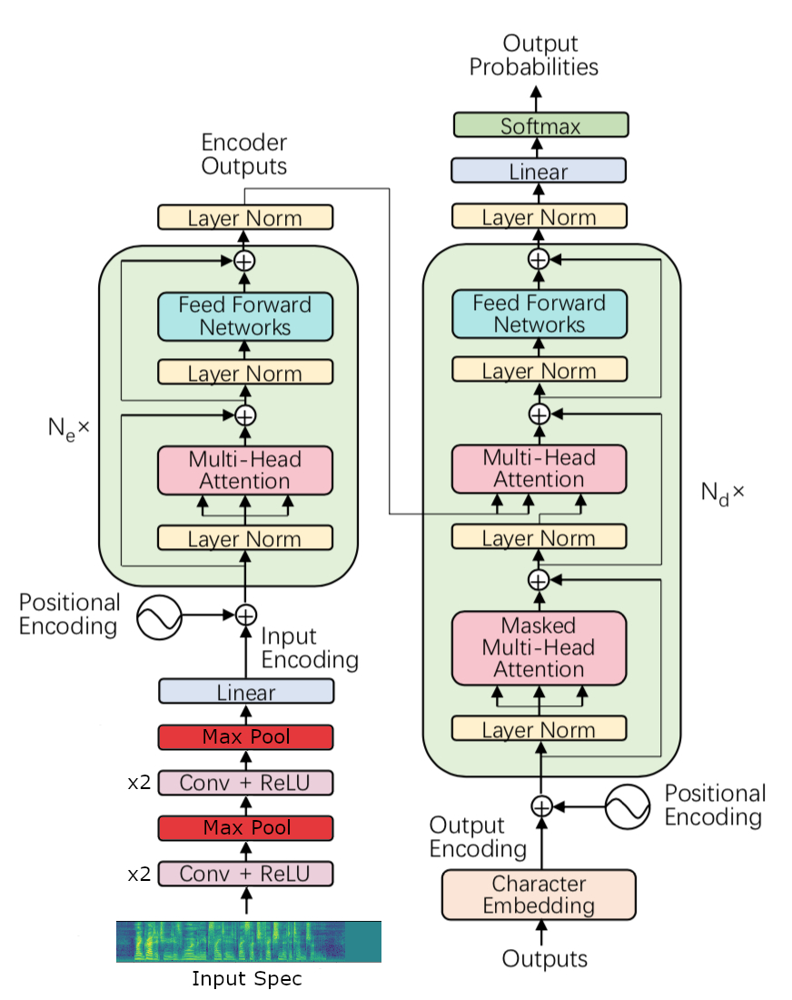

# Speech Transformer for Automatic Speech Recognition (ASR)

This repository presents a simple and easy to use implementation of a speech transformer network for speech recognition tasks. Written in python with tensorflow 2, it shows how to train and evaluate your own speech recognition model. Training can be performed with the configuration you want and pre-trained models used in any other tasks like a chatbot system per exemple.

The repository includes:
* [demo.ipynb](demo.ipynb), this is the easiest way to start, it shows an ASR exemple using models pre-trained on Librispeech.
* [speech_transformer.ipynb](speech_transformer.ipynb), a python notebook for training and decoding.
* [prepare_dataset.ipynb](prepare_dataset.ipynb), a notebook to prepare the Librispeech dataset before training.
* [pretrained](pretrained), a callbacks folder gathering weigts, configurations and tokenizers from pre-trained models.
* [speech_transformer.py](speech_transformer.py), a library of every functions needed for application.

Try in Colab :  

| Notebook | Colab Link |
|---|---|
| Demo |  |
| Speech Transformer |  |
| Dataset Preparation |  |

## Dataset
Training was performed on the Librispeech dataset but any other ASR corpus can be used.  
[Librispeech](http://www.openslr.org/12) is a corpus of approximately 1000 hours of 16kHz read English speech, prepared by Vassil Panayotov with the assistance of Daniel Povey. The data is derived from read audiobooks from the LibriVox project, and has been carefully segmented and aligned.

## Training setup
To train the models as fast as possible, training was performed using a 8 cores TPU device offered by Google Colab. The whole dataset was preprocessed and directly loaded in memory for training.  
Following [1], neighborhood label smoothing was applied to train the character models and SpecAugment [2] LD policy without time masking was used to avoid overfitting.  
Once trained, models can be loaded and evaluated with a GPU device for fast inference.
Subword or character encoding and multiple model sizes are possible. Depending if you are looking for real time applications or a better word error rate.

## Training on Librispeech
### 1. Data Preparation
See [prepare_dataset.ipynb](prepare_dataset.ipynb).  
Audio data are preprocessed into 80 dimentional filterbanks mel spetrograms with 10ms hop length and 25ms window size. The dataset is divided into three parts, clean and other for training and dev_clean for validation.  
Preprocessing can be executed on your own device for faster runtime.

### 2. Training
See [speech_transformer.ipynb](speech_transformer.ipynb).  
TPU hardware with high batch size and memory is recommended for training.
The default configuration is a small speech transformer with 3 encoder/decoder layers using subword encoding and a CNN preprocessing network. Less than 30 minutes of training should be sufficient to achieve more than 90% on the Librispeech dev-clean validation set.

### 3. Inference
Once trained, the model can be reloaded with GPU harware for fast inference.  
Both gready decoding and beam search decoding are possible.

# Model Architecture

## References
[1] Linhao Dong, Shuang Xu, Bo Xu, "SPEECH-TRANSFORMER: A NO-RECURRENCE SEQUENCE-TO-SEQUENCE MODEL FOR SPEECH RECOGNITION"  
[2] Daniel S. Park, William Chan, Yu Zhang, Chung-Cheng Chiu, Barret Zoph, Ekin D. Cubuk, Quoc V. Le, "SpecAugment: A Simple Data Augmentation Method for Automatic Speech Recognition"
[2] Daniel S. Park, William Chan, Yu Zhang, Chung-Cheng Chiu, Barret Zoph, Ekin D. Cubuk, Quoc V. Le, "SpecAugment: A Simple Data Augmentation Method for Automatic Speech Recognition"